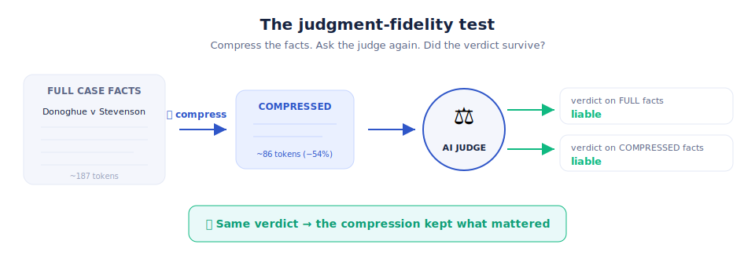
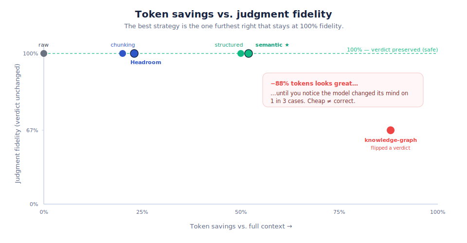
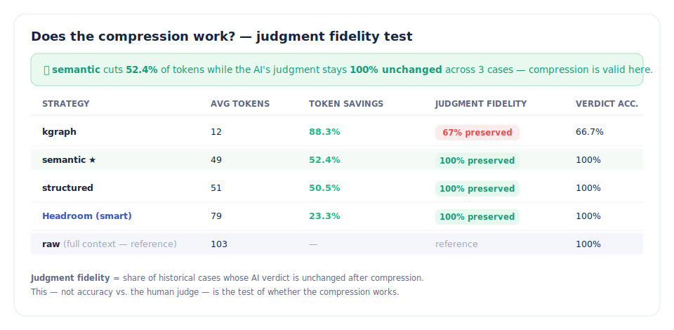
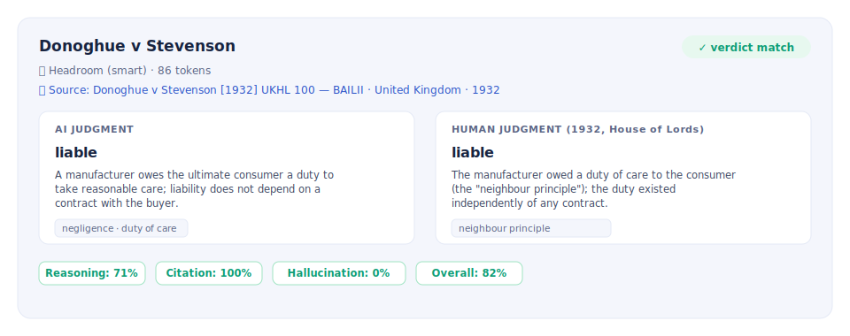

<p align="center">
  
</p>

<h1 align="center">How Good Is Your Context Compression? Let a Robot Judge Decide.</h1>

<p align="center"><em>I built a browser-native benchmark that measures whether your LLM context compression actually works — by making an AI re-judge 200-year-old court cases. It runs entirely on your GPU, in your browser. Come break it.</em></p>

---

## TL;DR

Everyone compresses LLM context to save tokens. Almost nobody measures whether the compression **threw away something that mattered**. Token count is easy to measure; *quality* is not.

So I flipped the problem around. Give an LLM a real court case and record its verdict. Now compress the facts and ask again. **If the verdict changes, the compression broke something. If it holds, the compression kept what mattered.** I call it *judgment fidelity*, and it turns out to be a brutally honest way to grade a compressor.

The whole thing — models and all — runs **100% in your browser on WebGPU**. No server, no API key, nothing leaves your device. 👉 **[Try it live](https://vishalmysore.github.io/judgeSaab/)** · **[Source](https://github.com/vishalmysore/judgeSaab)**

---

## The thing everyone does, and nobody checks

If you've built anything on top of an LLM, you've compressed context. You've trimmed tool outputs, summarized long documents, chunked, deduplicated, routed to smaller models, or squeezed your system prompt. There are whole listicles of *"15 ways to cut your token bill."* They all work — at cutting tokens.

But here's the uncomfortable question:

> How do you know your compression didn't quietly delete the one sentence that changes the answer?

You can *see* the token savings. You **cannot see** the fact you accidentally dropped. A compressor that cuts 88% of your tokens looks amazing on the invoice and can still be silently wrong.

We measure the cheap thing (tokens) and cross our fingers on the expensive thing (correctness).

## The idea: use a verdict as an oracle

Court cases are a beautiful test bed for exactly this problem, because every case comes with two things:

1. **Facts** — the input.
2. **A known outcome and reasoning** — the ground truth, decided by an actual court.

So the experiment writes itself:

<p align="center"></p>

Give the model the **full** facts → record the verdict. Give it the **compressed** facts → record the verdict again. The metric that matters isn't "did the AI agree with the human judge" — it's **"did the AI give the same answer on the compressed facts as on the full facts."** That's judgment fidelity, and it isolates exactly one thing: *did your compression preserve the decisive information?*

## Why old court cases? Because copyright.

I wanted **real** cases, not toy data — but court transcripts and modern opinions come with licensing baggage. The elegant escape hatch: **court opinions aren't copyrightable, and landmark old decisions are firmly in the public domain.** So JudgeSaab ships with famous, centuries-old cases, each linked to the actual judgment:

- **US Supreme Court** — *Marbury v. Madison* (1803), *McCulloch v. Maryland* (1819), *Gibbons v. Ogden* (1824), *Weeks v. United States* (1914)
- **English common law** — *Carlill v Carbolic Smoke Ball Co* (1892), *Donoghue v Stevenson* (1932), *Rylands v Fletcher* (1868), *Hadley v Baxendale* (1854)

These are the cases every first-year law student knows: the snail in the ginger beer, the smoke ball reward, judicial review itself. Perfect, unambiguous, and free to use.

## Watch compression break — on purpose

Here's the payoff. Run every compression strategy against the same cases and plot **token savings against judgment fidelity**:

<p align="center"></p>

Look at that lonely red dot. The **knowledge-graph** representation cut a jaw-dropping **88% of tokens** — and changed the model's mind on **1 in 3 cases**. It compressed away a fact that decided the outcome. On a dashboard that only tracks tokens, it would have looked like the *winner*.

Meanwhile **semantic**, **structured**, and **Headroom** cut 23–52% of tokens with the verdict **100% unchanged**. Same bill savings you'd actually trust.

The report makes the call for you:

<p align="center"></p>

> **The rule of thumb:** the best compressor is the one furthest *right* (most savings) that's still at *100% fidelity*. Everything past that cliff is you paying in correctness to save on tokens.

## A real case, end to end

Every case is shown side-by-side: what the AI decided vs. what the court actually held, which compression was applied, and a link to the real judgment so you can read it yourself.

<p align="center"></p>

Here the model reads a **Headroom-compressed** version of *Donoghue v Stevenson* — 86 tokens instead of ~190 — and still lands on **liable**, echoing Lord Atkin's 1932 "neighbour principle." The compression worked. And there's a 📎 link straight to the [actual House of Lords decision](https://www.bailii.org/uk/cases/UKHL/1932/100.html).

## The best part: it's all in your browser

No backend. No API key. No data leaving your laptop. JudgeSaab loads a real open-weight LLM — Llama, Qwen, Gemma, Phi, SmolLM, or Mistral — **directly onto your GPU via WebGPU + WebLLM**, and runs the entire benchmark client-side.

That means:

- 🔒 **Private by construction.** Your documents never touch a server. (Handy if you ever want to point this at *your* data instead of case law.)
- 🧪 **Reproducible.** Anyone with a Chromium browser can rerun the exact experiment.
- 🎛️ **Playable.** Switch the model, switch the compression, watch the fidelity move. It's a sandbox for context engineering.

It even ships with a faithful, dependency-free port of [**Headroom**](https://github.com/chopratejas/headroom) (Tejas Chopra's adaptive text compressor) so you can pit a *real* compression engine against the simpler strategies.

## Go break it

The single most useful thing you can do with JudgeSaab is find a case where compression flips a verdict that *you didn't expect*. Try it:

1. Open **[the live app](https://vishalmysore.github.io/judgeSaab/)** in Chrome or Edge (WebGPU required).
2. Pick a model (start small — Llama 3.2 1B loads fast) and a dataset (the landmark cases).
3. Hit **Run selected model** to get your baseline verdicts.
4. Hit **Compare compression** and watch the fidelity column.
5. Find the compressor that saves the most tokens *without* flipping a verdict. That's your answer.

Run it locally instead:

```bash
git clone https://github.com/vishalmysore/judgeSaab.git
cd judgeSaab
python -m http.server 8123
# open http://localhost:8123
```

If you find a spicy failure case, open an issue. That's the whole point.

---

## ⚠️ Disclaimer

- **This is an experiment, not a legal tool.** JudgeSaab is a research demo about *LLM context compression*. It is **not** legal advice, legal research, or a prediction of how any real court would rule, and it must not be used for any legal, professional, or decision-making purpose. If you have a legal question, talk to a qualified lawyer.
- **The cases are public domain.** Every bundled case is a landmark decision long in the public domain; court opinions are not subject to copyright. The facts and holdings are **summarized in my own neutral words** for benchmarking, and each case links to the authoritative source ([Justia](https://supreme.justia.com/), [BAILII](https://www.bailii.org/)). Nothing here reproduces copyrighted text.
- **LLMs make things up.** The verdicts, reasoning, and citations produced by the models are frequently wrong, incomplete, or hallucinated. Any resemblance to sound legal reasoning is incidental. Do not rely on model output for anything.
- **Scores are illustrative.** The metrics (verdict accuracy, reasoning similarity, judgment fidelity, etc.) are heuristic measures built for this demo, computed on a tiny bundled sample. They're meant to illustrate a *method*, not to certify any model or compression technique. Numbers in this article come from example runs and will vary by model, browser, and hardware.
- **No warranty.** Provided as-is for educational and research purposes. Not affiliated with any court, government, or the parties to any case.

---

<p align="center">
  <strong>JudgeSaab</strong> · browser-native · privacy-first · open source<br/>
  <a href="https://vishalmysore.github.io/judgeSaab/">Live demo</a> ·
  <a href="https://github.com/vishalmysore/judgeSaab">GitHub</a>
</p>
