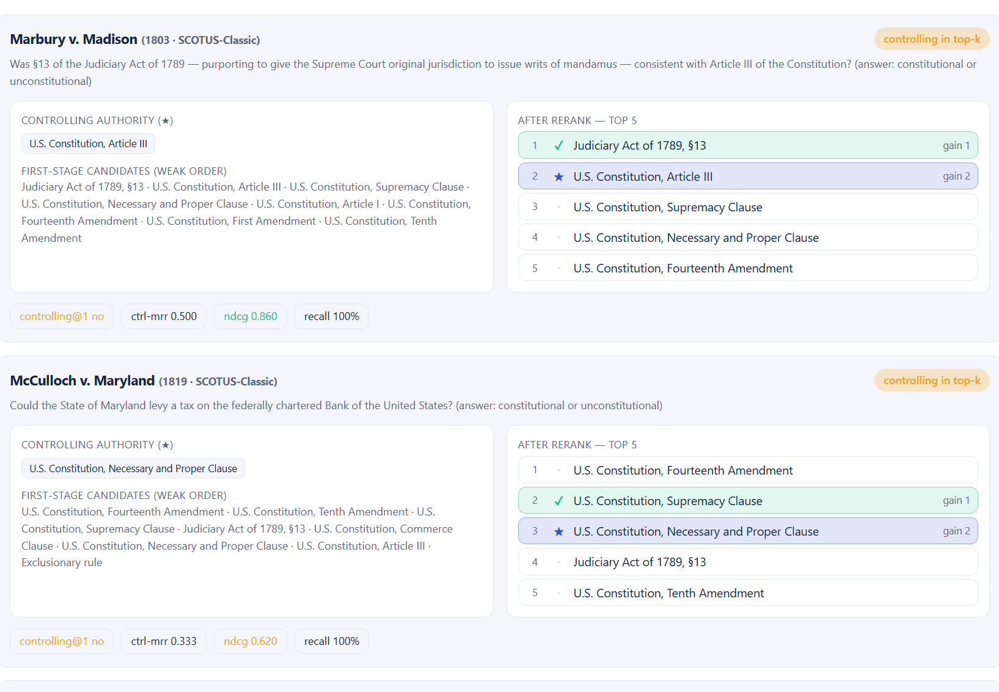

<p align="center">
  
</p>

<h1 align="center">How Good Is Your Reranking? Ask Which Precedent the Holding Turns On.</h1>

<p align="center"><em>Third stop in the JudgeSaab pipeline-test family. Retrieval asks "did you find the right sources?" Reranking asks the harder question: "of the sources you found, did you put the decisive one first?" — graded by which authority the court's holding actually turns on. Runs in your browser, no model, no GPU, nothing mocked.</em></p>

---

## TL;DR

A retriever's job is to *find* relevant documents. A reranker's job is to *order* them — to push the one document that actually decides the answer to the very top, because in a real RAG pipeline the model often only sees the first one or two.

So recall isn't enough. You can retrieve all the right authorities and still fail if the decisive one sits at rank 3 behind two near-misses. The metric that captures this is **controlling@1**: in how many cases did the reranker put the *controlling* authority — the provision the court's holding turns on — at rank 1?

And once again, the court labeled the data for us. Each case's citations are graded automatically: the **first-listed authority is controlling** (the one the decision is built on), the rest are cited-but-not-decisive, and everything else in the corpus is a distractor. No annotation budget, no mocks — real **BM25 / reciprocal-rank fusion / MMR** over the real corpus. 👉 **[Try it live](https://vishalmysore.github.io/judgeSaab/reranking/)** · **[Source](https://github.com/vishalmysore/judgeSaab)**

---

## The pipeline, one stage at a time

This is the third test in the family, and they nest exactly like a real RAG pipeline:

1. **[Compression](how-good-is-your-compression.md)** — squeeze the input, keep the verdict (*judgment fidelity*).
2. **[Retrieval](how-good-is-your-retrieval.md)** — find the authorities the court cited (*precedent recall@k*).
3. **Reranking** — put the *controlling* authority first (*controlling@1*). ← you are here.

Same legal corpus throughout, and every metric is anchored on something the court itself wrote down. Reranking just needs a *finer* label than retrieval did: not "was this cited?" but "was this the one that mattered most?"

## The setup: a weak retriever, then a reranker

Reranking only makes sense on top of a first stage, so the test builds one. A **deliberately weak retriever** (plain token overlap) proposes the top-8 candidate authorities for each case. That pool almost always *contains* the controlling authority — but often not at the top, because a lexically chatty distractor outscores it. That's the mess the reranker has to clean up.

Then each reranker reorders those 8 candidates:

- **No rerank** — keep the first-stage order (the honest baseline).
- **BM25 rerank** — reorder by length-normalized lexical relevance.
- **Reciprocal-rank fusion** — blend BM25 + TF-IDF + overlap rankings.
- **MMR** — relevance minus redundancy, for diversity.

Everything is scored with **graded** relevance (controlling = gain 2, other cited = gain 1, distractor = 0), so nDCG rewards putting the *right* authority high, not just *a* cited one.

<p align="center"></p>

## The result: reranking earns its keep — modestly, honestly

Here's the leaderboard on all 16 cases (weak first stage = overlap top-8, k = 5):

| Reranker | Controlling@1 | Controlling MRR | nDCG@5 (graded) |
|---|---|---|---|
| **BM25 rerank** | **81.3%** | 0.885 | 0.936 |
| Reciprocal-rank fusion | 81.3% | 0.880 | 0.933 |
| MMR (diversity) | 81.3% | 0.872 | 0.935 |
| No rerank (first stage) | 75.0% | 0.833 | 0.878 |

No hype here, and that's the point. Reranking lifts controlling@1 from **75% → 81%** and nDCG from **0.878 → 0.936**. It's a *real* gain, not a fabricated one — a reranker can only reorder what the first stage already surfaced, so on an easy corpus the ceiling is close and the honest delta is a few points. A benchmark that showed reranking doubling the score would be lying to you.

## Where reranking still fails — and why that's the useful part

The per-case view is where reranking gets interesting, because it shows the cases the reranker *doesn't* fix:

<p align="center"></p>

*Marbury v. Madison* — the controlling authority is **Article III** (the constitutional provision that makes §13 void). BM25 puts **Judiciary Act §13** at rank 1 instead: §13 is named all over the question, so it wins lexically. The court's decision *turns on* Article III, but the words point at §13. Controlling@1: **no**. Recall is still 100% — every cited authority is in the top 5 — but the decisive one is at rank 2.

*McCulloch v. Maryland* — the controlling **Necessary and Proper Clause** lands at rank 3, behind a distractor (the Fourteenth Amendment) and the also-cited Supremacy Clause. Recall 100%, controlling@1 **no**, nDCG 0.620.

These are exactly the failures that matter in production: the pipeline "found the right documents" (recall looks great on your dashboard) but fed the model the wrong one first. Purely lexical rerankers can't tell *named-in-the-question* from *decides-the-question* — which is precisely the gap a real cross-encoder or an LLM reranker is supposed to close. This test gives you the honest, ground-truthed baseline they have to beat.

## Nothing is mocked — here's exactly what runs

Worth being explicit, because it's a fair thing to ask of any benchmark:

- **The corpus is real content** — 29 legal authorities (statutes, constitutional provisions, ECHR articles, common-law doctrines), described in neutral prose, plus deliberate distractors.
- **The relevance labels are the court's own citations** — not annotator guesses, not synthetic.
- **The rerankers are real algorithms** — genuine BM25, TF-IDF cosine, reciprocal-rank fusion, and MMR, computed in the browser. No stubs, no hard-coded outputs.
- **It's deterministic** — same setup, same numbers, every time. There's no LLM and no vector database here on purpose: this stage is pure ranking math, so it runs instantly and reproducibly. (The one intentionally-synthetic element in the whole family is the retrieval test's clearly-labeled *random* floor — a baseline, used nowhere else.)

## Go break it

1. Open **[the reranking test](https://vishalmysore.github.io/judgeSaab/reranking/)** (no GPU needed).
2. Hit **Compare all rerankers** and note the gap over "No rerank."
3. Shrink **Candidates** to 4 and watch recall drop — the reranker can't rescue a controlling authority the weak first stage never proposed.
4. Find a case where recall is 100% but controlling@1 is *no*. That's a reranker that found the decisive authority and buried it — the failure a good reranker exists to prevent.

Run it locally instead:

```bash
git clone https://github.com/vishalmysore/judgeSaab.git
cd judgeSaab
python -m http.server 8123
# open http://localhost:8123/reranking/
```

Next in the family: **multi-hop / shepardizing** — does the pipeline notice a cited precedent was later overruled? Same corpus, same trick: the court already wrote down the answer.

---

## ⚠️ Disclaimer

- **This is an experiment, not a legal tool.** JudgeSaab is a research demo about *AI pipeline evaluation*. It is **not** legal advice or research and must not be used for any legal or decision-making purpose. If you have a legal question, talk to a qualified lawyer.
- **The cases and citations are public domain.** Every bundled case is a landmark decision long in the public domain; court opinions are not copyrightable. Facts, holdings, and authority descriptions are **summarized in my own neutral words**, with links to the authoritative source ([Justia](https://supreme.justia.com/), [BAILII](https://www.bailii.org/)).
- **"Controlling" is a modeling choice.** Designating the first-listed citation as controlling is a convenient heuristic for a demo, not a doctrinal ruling; real opinions are messier. The metrics illustrate a *method*, not a certification of any reranker. Numbers come from example runs and vary with the dataset, candidate count, and k.
- **No warranty.** Provided as-is for educational and research purposes. Not affiliated with any court, government, or the parties to any case.

---

<p align="center">
  <strong>JudgeSaab</strong> · browser-native · privacy-first · open source<br/>
  <a href="https://vishalmysore.github.io/judgeSaab/reranking/">Reranking test</a> ·
  <a href="https://vishalmysore.github.io/judgeSaab/retrieval/">Retrieval test</a> ·
  <a href="https://vishalmysore.github.io/judgeSaab/">Compression test</a> ·
  <a href="https://github.com/vishalmysore/judgeSaab">GitHub</a>
</p>
