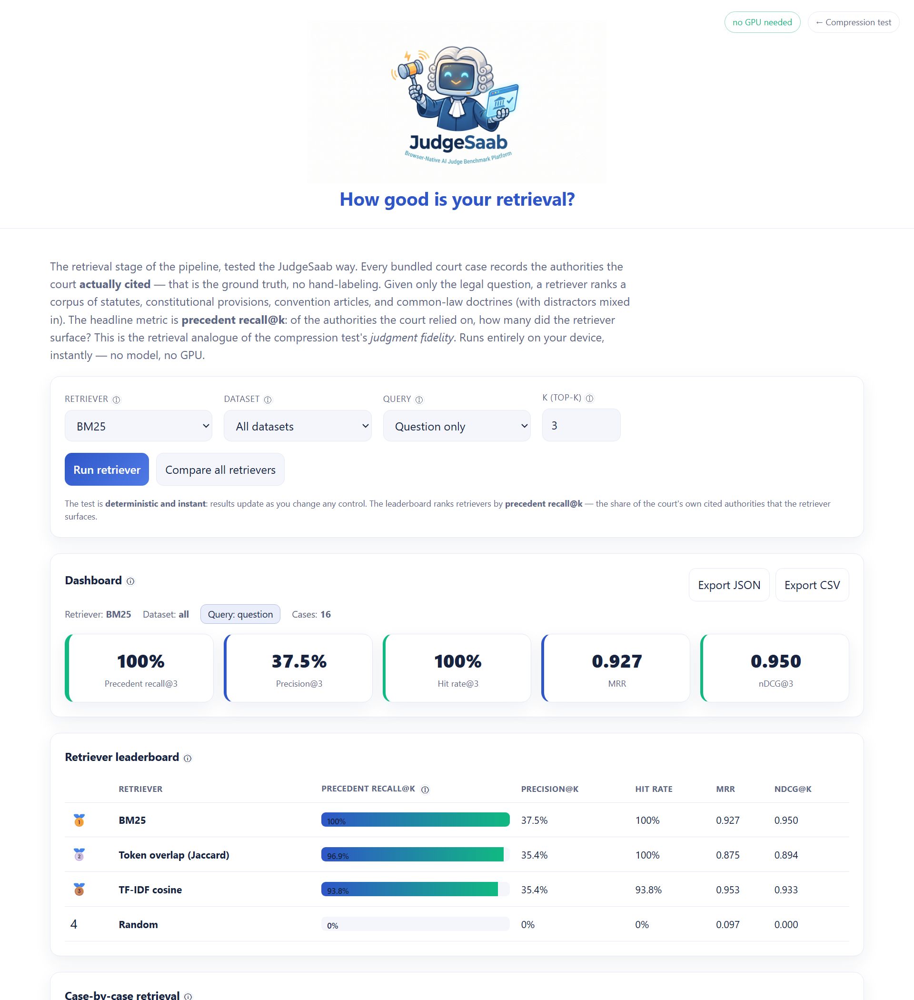
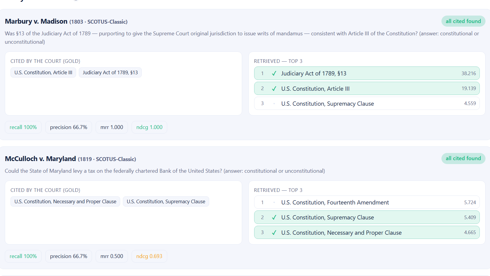

<p align="center">
  
</p>

<h1 align="center">How Good Is Your Retrieval? Let the Court's Own Citations Grade It.</h1>

<p align="center"><em>I extended my browser-native legal benchmark one pipeline stage upstream — from compression to retrieval — using a ground truth nobody had to hand-label: the authorities each court actually cited. It runs entirely in your browser, with no model and no GPU. Come break it.</em></p>

---

## TL;DR

RAG lives or dies on retrieval. If the retriever doesn't surface the right source, the smartest model in the world answers from thin air. But grading a retriever normally means paying humans to label which documents are "relevant" to each query — slow, subjective, and never quite trustworthy.

Court cases hand you that label for free. **Every judicial opinion cites the statutes, precedents, and doctrines the court relied on.** Those citations *are* the relevance judgments — authoritative, unambiguous, and produced by the court itself, not an annotator. So the test writes itself: give a retriever only the legal question, let it rank a corpus of authorities, and check how many of the ones the court *actually cited* it surfaced. I call it **precedent recall@k**, and it's the retrieval twin of the [judgment-fidelity](how-good-is-your-compression.md) metric from the compression test.

The whole thing runs **100% in your browser**. The lexical retrievers need **no LLM and no GPU**, so they're instant — and there's an optional **real dense-vector retriever** (MiniLM embeddings via Transformers.js) for when you want to pit semantic search against BM25. 👉 **[Try it live](https://vishalmysore.github.io/judgeSaab/retrieval/)** · **[Source](https://github.com/vishalmysore/judgeSaab)**

---

## One good idea, reused

The [original JudgeSaab](https://vishalmysore.github.io/judgeSaab/) asked a single question about **compression**: if you squeeze a case's facts and the AI judge still reaches the same verdict, the compression kept what mattered. The trick that made it work was *anchoring on a ground truth the court already produced* — the verdict.

Legal data is unusually generous with that kind of anchor, and the verdict is only the first one. Opinions also carry:

- the **authorities cited** — a ready-made retrieval relevance set,
- the **controlling vs. merely-mentioned** distinction — a reranking label,
- the **statute hierarchy** — a chunking boundary,
- the **overruling history** — a multi-hop "is this still good law?" label.

So instead of one benchmark, there's a *family* of them: **one legal corpus, a test per pipeline stage, each anchored on ground truth the court itself wrote down.** This article is the first extension — retrieval.

## The setup: citations as relevance judgments

Every bundled case already lists the authorities the court leaned on. Take *Marbury v. Madison* (1803): the court's decision turns on **Article III of the Constitution** and **§13 of the Judiciary Act of 1789**. Those two are, by definition, the relevant documents for Marbury's question. No labeling required — the court did it in 1803.

The retriever's job: given **only the legal question** (optionally with the facts), rank a fixed corpus of **29 legal authorities** — 15 that are cited by at least one case (the gold answers) plus **14 distractors** chosen to be plausibly close (the Fifth and Sixth Amendments, Chevron deference, ECHR Article 10 free expression, the doctrine of consideration…). The distractors are the whole point: with them in the pool, a good score means the retriever actually discriminated, not that it got a gimme.

Then score the ranking against the court's citations with the standard IR metrics — **precedent recall@k**, precision@k, hit rate, MRR, and nDCG@k.

<p align="center"></p>

Swap the retriever from the dropdown and every number updates instantly. Because it's pure lexical math — no model weights, no sampling — the results are **deterministic**: same setup, same score, every time.

## Watch the retrievers separate

Here's the leaderboard on all 16 cases, querying on the **question alone** (the honest information-need test — feeding the facts in too leaks lexical hints about the answer), scored at **k = 3**:

| Retriever | Precedent recall@3 | MRR | nDCG@3 |
|---|---|---|---|
| **BM25** | **100%** | 0.927 | 0.950 |
| Token overlap (Jaccard) | 96.9% | 0.875 | 0.894 |
| TF-IDF cosine | 93.8% | **0.953** | 0.933 |
| Random | 0% | 0.097 | 0.000 |

Two things worth staring at:

1. **The floor is honest.** Random retrieval scores ~0% recall — with distractors outnumbering the gold answers almost 1:1, guessing gets you nothing. That's the sanity check every benchmark should have and most don't.
2. **The metrics disagree — on purpose.** BM25 wins *recall* (it gets all the cited authorities into the top 3), but TF-IDF wins *MRR* (it's better at putting the single most relevant authority in slot 1). A dashboard that reports only one number would crown the wrong retriever depending on which number it picked. Retrieval quality isn't scalar, and the test refuses to pretend it is.

## Adding a real vector store — dense embeddings, in the browser

BM25 and TF-IDF are lexical: they match *words*. Modern RAG usually reaches for *semantic* retrieval — dense embeddings that match *meaning*. So the test ships one too, and it's the real thing, not a placeholder: selecting **Semantic** loads [`Xenova/all-MiniLM-L6-v2`](https://huggingface.co/Xenova/all-MiniLM-L6-v2) via [Transformers.js](https://github.com/huggingface/transformers.js), embeds the corpus into an in-memory vector index, and ranks by cosine similarity. The model (~23 MB, quantized) runs entirely in your browser — no server, no API, nothing mocked. The lexical retrievers stay instant; the embedding model loads only when you ask for it.

And here's the honest result on this corpus:

| Retriever | Precedent recall@3 | MRR | nDCG@3 |
|---|---|---|---|
| **BM25** | **100%** | 0.927 | 0.950 |
| Token overlap (Jaccard) | 96.9% | 0.875 | 0.894 |
| TF-IDF cosine | 93.8% | **0.953** | 0.933 |
| **Semantic (MiniLM)** | 90.6% | **0.953** | 0.913 |
| Random | 0% | 0.097 | 0.000 |

The dense retriever **does not win**. On short, keyword-dense legal labels — "Fourth Amendment", "Judiciary Act of 1789, §13" — exact lexical match is a genuinely strong signal, and a 22M-parameter general-purpose embedding model has no special knowledge of statute numbers. It ties TF-IDF for the best MRR but trails BM25 on recall. That's not a bug; it's the widely-underappreciated reality that **hybrid lexical+dense retrieval usually beats either alone**, and that "just add embeddings" is not a free upgrade. A benchmark worth trusting is one that will happily tell you your fancy vector store lost to a 1970s ranking function.

## A case, ranked

The real insight is per-case. Every query shows the authorities the court cited (gold) beside the retriever's top-k, with a ✓ on each cited authority it surfaced:

<p align="center"></p>

*Marbury* is the clean case: BM25 puts **Judiciary Act §13** and **Article III** at ranks 1 and 2 — both cited authorities, recall 100%, MRR 1.0. Textbook.

*McCulloch v. Maryland* is the instructive one. The court cited the **Necessary and Proper Clause** and the **Supremacy Clause** — and the retriever *does* find both, so recall is still 100%. But it ranked a **distractor, the Fourteenth Amendment**, at slot 1, pushing the real authorities to 2 and 3. Recall says "perfect"; MRR (0.5) and nDCG (0.693) quietly say "…but your top hit was wrong." That gap between recall and rank-quality is exactly the failure mode that sinks a RAG system when you only feed the model the top 1–2 chunks. Being able to *see* it, per case, is the point.

## Why this matters beyond law

Strip away the robes and this is a general recipe for testing retrieval without an annotation budget: **find a domain where the "right documents" are already written down.** Papers cite papers. Wikipedia articles link their sources. Code references the functions it calls. Support tickets link the docs that resolved them. In each, the author has handed you a relevance judgment for free — and you can grade your retriever against it the same way JudgeSaab grades BM25 against a 200-year-old Supreme Court opinion.

Law just happens to be an unusually clean instance: the citations are formal, authoritative, and public domain.

## Go break it

1. Open **[the retrieval test](https://vishalmysore.github.io/judgeSaab/retrieval/)** (no GPU needed — works in any browser).
2. Hit **Compare all retrievers** and read the leaderboard.
3. Switch **Query** from *question only* to *question + facts* and watch recall jump — that's lexical leakage from the scenario text, a real effect worth understanding.
4. Scroll to a case card and find one where recall is 100% but MRR is low. That's a retriever that finds the right answer but ranks it badly — the sneakiest RAG failure there is.

Run it locally instead:

```bash
git clone https://github.com/vishalmysore/judgeSaab.git
cd judgeSaab
python -m http.server 8123
# open http://localhost:8123/retrieval/
```

Next stop in the family: **reranking** (does the *controlling* authority rank first?) and **multi-hop** (does the pipeline notice a cited precedent was later overruled?). Same corpus, same trick.

---

## ⚠️ Disclaimer

- **This is an experiment, not a legal tool.** JudgeSaab is a research demo about *AI pipeline evaluation*. It is **not** legal advice, legal research, or a statement of what any authority requires, and must not be used for any legal or decision-making purpose. If you have a legal question, talk to a qualified lawyer.
- **The cases and citations are public domain.** Every bundled case is a landmark decision long in the public domain; court opinions are not copyrightable. Facts, holdings, and the authority descriptions are **summarized in my own neutral words** for benchmarking, and each case links to the authoritative source ([Justia](https://supreme.justia.com/), [BAILII](https://www.bailii.org/)). Nothing here reproduces copyrighted text.
- **The gold set is a modeling choice.** "Relevant" here means "cited in the bundled summary of the opinion." Real opinions cite more; the corpus is small and curated for a demo. The metrics illustrate a *method*, not a certification of any retriever. Numbers come from example runs and will vary with the dataset, query mode, and k.
- **No warranty.** Provided as-is for educational and research purposes. Not affiliated with any court, government, or the parties to any case.

---

<p align="center">
  <strong>JudgeSaab</strong> · browser-native · privacy-first · open source<br/>
  <a href="https://vishalmysore.github.io/judgeSaab/retrieval/">Retrieval test</a> ·
  <a href="https://vishalmysore.github.io/judgeSaab/">Compression test</a> ·
  <a href="https://github.com/vishalmysore/judgeSaab">GitHub</a>
</p>
