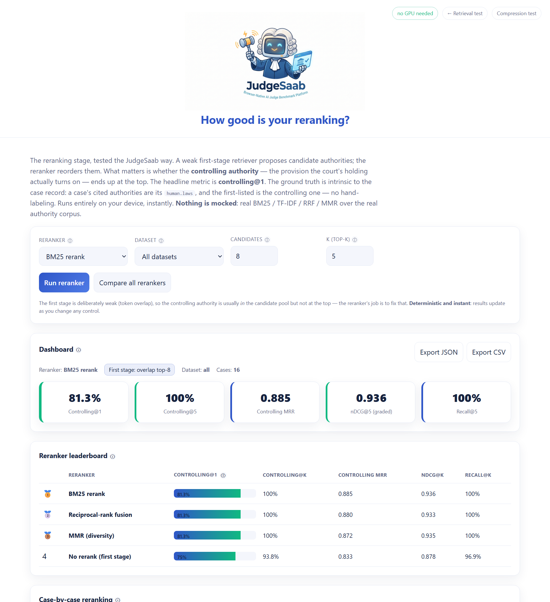

  

<h1 align="center">How to Validate Your AI Pipeline (Without an Annotation Budget)</h1>

<em>Everyone ships RAG and agents. Almost nobody validates them stage by stage — because "getting ground truth" sounds like a labeling project. It isn't. The right documents already contain the answer. Here's the full map, and a live demo you can break in your browser.</em>

  🔗 <strong><a href="https://vishalmysore.github.io/judgeSaab/">Try the live demo → JudgeSaab</a></strong>

---

## TL;DR

Your AI pipeline is a chain — chunk → embed → retrieve → rerank → compress → reason → act. If one link is quietly broken, the whole thing produces confident nonsense, and a single end-to-end "does the answer look good?" eval will never tell you *which link* failed.

The reason people don't test each stage is that every stage seems to need its own labeled dataset, and labeling is expensive and subjective. **The trick: don't label anything. Pick a document type that already recorded the answer for that stage** — a court verdict, a patent's claim tree, a screenplay's scene breaks, a spreadsheet's formula. Then check whether your stage preserves it.

This article gives you the full **document → pipeline-function** map, the one rule behind it, and a working reference implementation — **[JudgeSaab](https://vishalmysore.github.io/judgeSaab/)**, which validates compression, retrieval, and reranking on real legal cases, 100% in your browser.

---

## The problem: "vibes-based" evals

Ask most teams how they validate their RAG stack and you'll hear some version of: *"we ran a few queries and the answers looked good."* That's not validation — that's a demo.

The uncomfortable truth is that a good final answer can hide a broken pipeline (your reranker buried the right document, but the model guessed correctly anyway), and a bad final answer tells you *something* is wrong but not *what*. You need **per-stage, ground-truthed tests**. And the blocker to those has always been the same:

> "Where do I get labeled data for *chunk quality*? For *whether retrieval found the right source*? For *whether the plan was valid*?"

You don't buy it. You find a document that was born with it.

## The core insight: documents that grade themselves

Some documents record, as a byproduct of their format, exactly the thing a pipeline stage is supposed to get right:

- A **court opinion** records the **verdict** → so it can grade *compression* (did squeezing the facts change the verdict?).
- A **screenplay** prints its own **scene boundaries** → so it can grade *chunking* (did you split mid-scene?).
- A **patent** numbers its **claim dependencies** → so it can grade *structural chunking* and *scope reasoning*.
- A **spreadsheet** stores a **formula and its result** → so it can grade *tool-use* (did the action compute the right value?).
- A **chess game** records **legal moves and the final result** → so it can grade an *agent's trajectory*.

No annotator. No budget. The ground truth is already in the file, put there by the author, the court, the examiner, or the rules of the game.

## The full map: what document validates what function

Here's the whole pipeline, phase by phase — the document type to use, the ground truth it hands you for free, and the metric.

### Phase 1 — Ingestion (chunk · extract · dedup · classify)

| Document type | Free ground truth | Validates | Metric |
|---|---|---|---|
| Screenplays / plays | scene & act boundaries (sluglines) | **Chunking** | boundary alignment · scene-integrity |
| Patents | claim dependency tree | **Chunking** (structural) | claim-graph reconstruction |
| Statutes / contracts | Title→§→clause hierarchy, defined terms | **Chunking** · grounding | boundary F1 · term consistency |
| 10-K filings (+XBRL) | XBRL-tagged financial facts | **Extraction** / table-QA | field exact-match |
| News-wire articles | same story republished across outlets | **Deduplication** | dup-detection F1 |
| Support tickets / GitHub issues | human-assigned queue / labels | **Classification / routing** | routing accuracy |

### Phase 2 — Representation & Retrieval (embed · retrieve · rerank · multi-hop)

| Document type | Free ground truth | Validates | Metric |
|---|---|---|---|
| Court cases / patents | citations / prior-art references | **Retrieval** | recall@k ✅ |
| Court cases / patents | controlling authority / §102 reference | **Reranking** | controlling@1 ✅ |
| StackOverflow / Quora | duplicate-question links | **Embedding** (semantic equivalence) | dup nearest-neighbor rate |
| Wikipedia | redirects (synonyms) + link graph | **Embedding · Multi-hop** | neighbor rate · hop-path accuracy |
| Wikidata / genealogies | typed relation edges | **Graph retrieval** | path correctness |
| Subtitle / parliament pairs | professional translations | **Cross-lingual retrieval** | round-trip fidelity |

### Phase 3 — Generation (compress · summarize · ground · reason)

| Document type | Free ground truth | Validates | Metric |
|---|---|---|---|
| Court cases | the verdict | **Compression** (context distillation) | judgment fidelity ✅ |
| Papers / news | abstract / headline | **Summarization** | key-fact preservation |
| Patents | claim ⊂ parent-claim (scope) | **Reasoning** (entailment) | scope-monotonicity |
| Formal proofs (Lean/Coq) | machine-checkable proof | **Reasoning / verification** | does it check |
| Sudoku / logic puzzles | unique verifiable solution | **Constraint reasoning** | solved rate |
| Any source (court record) | grounded-in-source flag | **Hallucination / grounding** | groundedness ✅ |

### Phase 4 — Agentic (plan · act/tool-use · execute · remember)

| Document type | Free ground truth | Validates | Metric |
|---|---|---|---|
| Recipes / assembly manuals | ordered dependent steps (DAG) | **Planning** | topological validity |
| Spreadsheets | formula → computed value | **Tool-use / action** | exact-output match |
| SQL DB + query log | query → result set | **Tool-use** (SQL) | result-set match |
| API docs (request/response) | call → expected response | **Function-calling** | schema + param correctness |
| Shell / CI transcripts | command → resulting state | **Execution / recovery** | state match · recovery rate |
| Chess/Go records (PGN) | legal moves + result | **Multi-step trajectory** | legal-move rate · outcome |
| Detective novels | the reveal + planted clue | **Long-context / memory** | answer *and* cite the clue |

## The one rule

Every row above obeys a single principle — the thing to remember if you forget the whole table:

> **Use the document that already recorded the answer for that stage** — as *structure* (claim trees, sluglines, section hierarchy), as a *link* (citations, duplicates, redirects), as an *outcome* (verdicts, game results, grant/reject), or as a *checkable fact* (formulas, proofs, query results).
>
> If a document carries none of those, it can't anchor a test.

## A working example: JudgeSaab

Talk is cheap, so this framework ships as a live, open-source reference implementation you can break right now — **[JudgeSaab](https://vishalmysore.github.io/judgeSaab/)**. It validates three pipeline stages on real, public-domain court cases, and every metric is anchored on something the court itself wrote down. It runs **100% in your browser** — no server, no API key, nothing uploaded.

- **[Compression test](https://vishalmysore.github.io/judgeSaab/)** — compress a case's facts, re-run an AI judge (via WebGPU + WebLLM), and check whether the *verdict survives*. Metric: **judgment fidelity**.
- **[Retrieval test](https://vishalmysore.github.io/judgeSaab/retrieval/)** — given only the legal question, does the retriever surface the authorities the court *actually cited*? Metric: **precedent recall@k**. Includes a real in-browser dense-vector retriever (MiniLM embeddings) alongside BM25 — nothing mocked.

- **[Reranking test](https://vishalmysore.github.io/judgeSaab/reranking/)** — a weak first stage proposes candidates; does the reranker lift the *controlling* authority (the one the holding turns on) to rank 1? Metric: **controlling@1**.

The best part is how *honest* ground-truthed tests are. JudgeSaab will happily tell you that a knowledge-graph compression cut 88% of tokens **and flipped one verdict in three**, or that a fancy dense-vector retriever **lost to 1970s BM25** on short legal labels. A vibes eval would have congratulated both.

## How to apply this to your pipeline

1. **List your stages.** Chunk, embed, retrieve, rerank, compress, reason, plan, act. Most teams can't name where their pipeline breaks because they've never drawn it.
2. **For each stage, find the self-grading document** in the table above (or the [free sources](#free-sources) below). Pick one that resembles your real data.
3. **Extract the ground truth mechanically** — parse the citations, the sluglines, the claim numbers, the formula outputs. No labeling.
4. **Test the invariant, not the vibe.** Did compression change the verdict? Did the chunk split a scene? Did retrieval find the cited source? Each is a yes/no you can score at scale.
5. **Add a floor and watch metrics disagree.** A random baseline keeps you honest; when recall and MRR crown different winners, you've learned your quality isn't one number.

### Free, license-safe sources

Project Gutenberg (plays, Sherlock Holmes) · USPTO / Google Patents · SEC EDGAR (10-K + XBRL) · Wikipedia & Wikidata dumps · the StackExchange data dump · Lean **mathlib** · the Lichess PGN database · OpenSubtitles / Europarl · public GitHub issues. Court opinions and patents are especially clean: they're not copyrightable and they're rich with structure.

## Go break it

The fastest way to *get* this is to watch a ground-truthed test disagree with your intuition:

1. Open **[JudgeSaab](https://vishalmysore.github.io/judgeSaab/)** in Chrome or Edge.
2. Run the **[retrieval test](https://vishalmysore.github.io/judgeSaab/retrieval/)** and find a case where recall is 100% but the top result is wrong.
3. Run the **[reranking test](https://vishalmysore.github.io/judgeSaab/reranking/)** and find a case a reranker *can't* fix.
4. Then go draw your own pipeline and ask, for each stage: *what document already knows the answer?*

⭐ **[Star / fork JudgeSaab on GitHub](https://github.com/vishalmysore/judgeSaab)** · 🔗 **[Live demo](https://vishalmysore.github.io/judgeSaab/)**

If this framework saved you a labeling project, share it with the person on your team who owns the eval story. That's the one who needs it most.

---

  <strong>JudgeSaab</strong> · validate your AI pipeline · browser-native · privacy-first · open source 
  <a href="https://vishalmysore.github.io/judgeSaab/">Live demo</a> ·
  <a href="https://vishalmysore.github.io/judgeSaab/retrieval/">Retrieval test</a> ·
  <a href="https://vishalmysore.github.io/judgeSaab/reranking/">Reranking test</a> ·
  <a href="https://github.com/vishalmysore/judgeSaab">GitHub</a>

